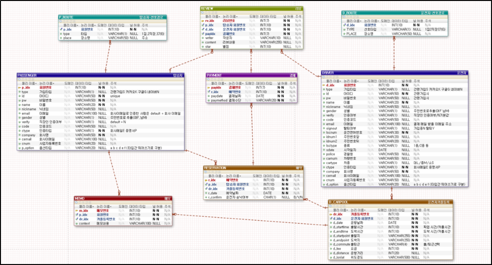
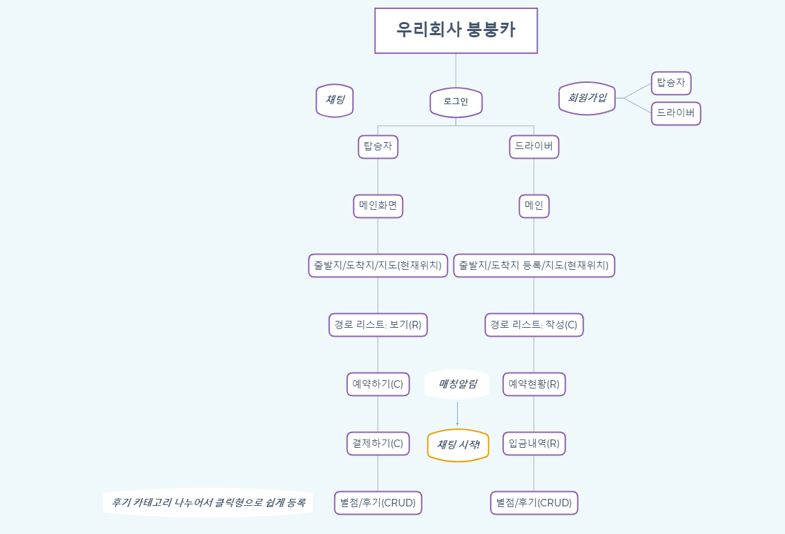

# 프로젝트명

## 🚗🚙🚕Yeon Cha ('연차') - 직장인들을 위한 카풀 웹앱 서비스

## 🚘[**탑승자 페이지로 이동**](http://13.125.252.85:8080/passenger/)

## 🚖[**운전자 페이지로 이동**](http://13.125.252.85:8080/driver/)

# 목차
[1.개요](#개요)

[2.목적](#목적)

- 기존 서비스와의 차별점

[3.전체 소스 코드](#전체-소스-코드-click)

[4.사용한 기술](#사용한-기술)

[5.주요 기능](#주요-기능)

[6.버전별 업데이트 내역](#버전별-업데이트-내역)

[7.발생한 이슈 & 해결 방법](#발생한-이슈--해결-방법)

[8.상세 설명](#상세-설명)

 - DB 구조 (ERD)

 - 전체 흐름도
 
 - 프로젝트 설명 PPT

[9.시연 영상](#시연-영상)

[10.참여인원](#참여-인원-5명)

***

### 개요

출,퇴근길에 직장인들이 이용할 수 있는 카풀 서비스이며, '운전자용'과 '탑승자용'페이지가 나누어져 있어 서로 원하는 시간대에 카풀을 매칭시켜주는 서비스 입니다.

### 목적

> 2030 비슷한 나이대, 비슷한 직급끼리 카풀을 하면서
> 1. 출퇴근 시간을 줄이고
> 2. 택시비 절감 / 유류비 절감을 할 수 있다.
> 3. 또한, 자신과 비슷한 직무 혹은 다른 업종 사람들과 교류를 할 수 있다.

- **기존 서비스와의 차별점**

    - 직장인 전용 웹 앱 : 엄격한 탑승자, 운전자 가입 처리로 믿을 수 있는 웹앱
    - 운전자와 탑승자 모두 성별 선택 기능
    - 개인 정보 노출 최소화 : 상세 주소 대신 주변 편의점/지하철역 등으로 등록
    - 운전자가 미리 등록한 경로를 사용자가 선택하는 방식
    - 결제 방법의 다양화

### 전체 소스 코드 [[click!](https://github.com/mand2/y-car-project)]

# 공헌한 내용

### 소스 코드

- <전체> [탑승자용 로그인/회원가입/마이페이지/메모 기능 페이지](https://github.com/iDaeun/BBCar)
- <서버 - Spring> [로그인/회원가입/마이페이지](https://github.com/iDaeun/BBCar/tree/master/ycar-Passenger)
- <서버 - SpringBoot> [마이페이지/메모](https://github.com/iDaeun/BBCar/tree/master/ycar-PassengerBoot)
- <클라이언트> [뷰 페이지](https://github.com/iDaeun/BBCar/tree/master/ycar-PassengerClient)

### 사용한 기술

- 웹 화면 구성 : `HTML5` `CSS3` `bootstrap4` `JavaScript`
- 검색 결과 데이터 요청 및 출력 : `jQuery` `Ajax` `JSON`
- 결과를 얻어오기 위한 서버 액션 : `JAVA` `JSP` `EL` `jQuery`
- DB 액션 처리 : `MyBatis` `JPA`
- DBMS : `MySQL`
- 개발 Tool : `Eclipse` `Spring Tool Suite` `Apache Tomcat v8.0` `Visual Studio Code` `Ubuntu` `Brackets`
- AWS 배포 : `EC2` `RDS`
- 로그인 Api : `KakaoTalk API`
- 프로젝트 구조 : `RESTful API`
- 프레임워크 : `Spring Framework` `Spring Boot` `NodeJs` `Ruby On Rails`
- 프로젝트 관리 Tool : `Google Drive` `GitHub`

### 주요 기능

- 로그인 : 일반 로그인, 카카오 로그인 `spring`
- 회원가입 : 이메일을 통한 직장인 인증, 선호 환경 검색 `spring`
- ID찾기/PW찾기 : 아이디 또는 임시비밀번호 email발송 `spring`
- 마이페이지 : 저장 정보 출력 및 수정 `spring` `spring boot`
- 메모 : 예약가능 카풀 리스트 출력, 카풀 선택 후 메모 작성 `spring boot` `Ruby on Rails`
- 1:1 채팅 : 탑승자 & 운전자 간 채팅 `NodeJs`

# 버전별 업데이트 내역

[상세 내역은 커밋 내용 참고](https://github.com/iDaeun/BBCar/commits/master)

### # ver 0.1 ~ 0.2

- 메인 및 로그인 뷰 페이지 구현
- 로그인 기능 구현 (Spring)
- ID찾기, PW찾기 기능 구현 (Spring)
- KAKAO API 활용하여 카카오 로그인 실행
- 로그인한 회원 정보 sessionStorage 저장 처리

### # ver 0.3

- 로그인 구조 변경 : client APP에서 RestTemplate 사용
- 로그인한 회원 정보 session처리 변경 : sessionStorage → controller에서 session처리
- 운전자/탑승자 모드에 따라 분기처리

### # ver 0.4 ~ 0.5

- 마이페이지 뷰 페이지 구현
- 마이페이지 기능 구현 : 내 정보 출력, 정보 수정 (Spring)
- 유효성 검사
- 임시 비밀번호 발급 회원 → 마이페이지 수정 폼으로 이동처리

### # ver 0.6 ~ 0.7

- 회원가입 뷰 페이지 구현
- 회원가입 기능 구현
- 마이페이지 기능 구현 : 선호 탑승 환경, 선로 루트 출력 (Spring Boot, JPA)

### # ver 0.8

- 탑승자 메모 기능 구현 : 등록된 카풀 리스트 출력, 카풀 선택하여 메모 작성 (Spring Boot, JPA) - 진행 중

### # ver 0.9

- 탑승자 ↔ 운전자 1:1 채팅 기능 구현 (NodeJs Socket.io)
- 탑승자, 운전자 예약한 카풀 리스트 출력 기능 Spring Boot 구조로 변경 (Spring Boot, JPA)

### # ver 1.0

- 로그아웃 기능 구현
- 프로젝트 합본 업로드
- test위해 passenger Client & server url주소 localhost로 변경
- 카카오톡 회원가입 기능 구협
- 회원탈퇴 기능 구현
- 마이페이지 수정 : 카카오톡 로그인회원 / 일반 로그인회원 구분

... 계속 업데이트 예정

# 발생한 이슈 & 해결 방법

### "REST 구조를 더 깊게 이해할 수 있는 계기"

- session처리

[상황] 메인 서버에서 로그인 확인 후 회원 정보를 클라이언트 서버 쪽으로 넘겨주어 session을 저장해야 함

[문제] sessionStorage를 사용하여 저장하면 보안에 취약하여 사용자 개인정보를 저장하기에 부적합함

[해결] 클라이언트 서버에 controller를 만들어 Rest Template 사용, 메인 서버에서 받은 로그인한 회원의 정보를 클라이언트 controller에서 저장함

- Rest Template 사용 시 변수의 casting error

[상황] Rest구조 구현 시 Rest Template 활용

[문제] 두 번이나 컨트롤러를 거치는 구조라 객체를 주고받을 때 문제가 발생, 변수의 casting error

[해결] exchange 메서드를 사용, header와 body를 직접 지정하고, request method 도 지정하여 데이터 통신

### “새롭게 배운 Spring Boot 와 JPA 개념 이해 및 적용”

- JPA @Query와 @OneToMany 

[상황] 테이블 2개를 조인해야 하는데 조건이 붙음

[문제] @Query("select d from DCarpoolEntity d join RsvEntity r where r.r_confirm is null or = 'B' order by d.d_date desc")로 조건을 넣어줬는데 bean을 생성하지 못하거나 'idx'를 찾지 못한다는 여러 오류가 발생

[해결] @Query를 쓸 때는 @OneToMany & @ManyToOne와 같이 entity내부에서 관계설정을 해주지 못함 (join이 겹치기 때문), @Query를 쓰지 않고 값을 한꺼번에 받아온 다음, service 내에서 필터링 처리 → DTO생성하여 필요한 데이터 넣어줌

- JPA @ManyToOne과 @ID

[상황] 탑승자가 예약한 카풀 리스트를 뽑아야 하는 상황, RESERVATION 테이블 & D_CARPOOL 테이블 JOIN하려고 @ManyToOne으로 관계 설정을 한 뒤 RESERVATION의 p_idx값으로 데이터를 list로 출력해야 함

[문제] list으로 출력은 되나 들어있는 데이터가 첫번째 데이터로 반복
예) 뽑아야하는 데이터가 5개면 list 안의 객체가 5개이나 RESERVATION정보 & D_CARPOOL(조인 테이블)정보가 첫번째 객체의 내용으로 반복됨

[해결] RsvEntity (RESERVATION)의 r_idx에 @ID를 부여 (= DB의 RESERVATION 테이블의 pk와 동일하게 맞춤)

- JPA @Column의 nullable

[상황] 탑승자의 예약 정보를 출력해야 함

[문제] r_confirm = null인경우 (값이 null인 경우)에는 오류 발생

[해결] 해당 컬럼에 @Column(nullable = true) 작성

- JPA 테이블 조인 시 동일한 이름의 변수가 있다!

[상황] 두개의 테이블을 조인하여 사용해야 함

[문제] 둘 다 'dr_idx'라는 동일한 이름의 변수를 가지고 있음

[해결] 한 쪽 entity에 해당 컬럼에 (insertable = false, updatable = false) 작성

- JPA list출력시 'java.lang.StackOverflowError: null'

[상황] @OneToMany로 관계설정한 두 테이블의 정보를 조인하여 list로 출력하려고 함

[문제] 무한루프에 빠짐

[해결] 각 entity 안에서 @Override했던 toString()을 삭제
참고: stackoverflow ([https://stackoverflow.com/questions/17445657/hibernate-onetomany-java-lang-stackoverflowerror/17445773](https://stackoverflow.com/questions/17445657/hibernate-onetomany-java-lang-stackoverflowerror/17445773))

**JPA 깨달은 점 >**

JPA는 관계형데이터베이스(RDB)와 달리 데이터를 하나의 객체(entity)로 간주하기 때문에 메모리 데이터베이스에 더 적합하다. 따라서 sql문을 직접 쓰지 않고 어노테이션으로 id, column을 설정하면 DB에서 데이터를 가져와 사용할 수 있다. 

entity안에는 내가 필요한 변수(컬럼)만 써주어도 되고, @ID는 select문을 쓰는 경우 필요하지 않다. ex) PassengerEntity, RRouteEntity 변수에 따로 pk를 @ID로 맞추지 않았음.

entity간 관계설정을 해줄때 특히 중요한 점 상황에 맞춰 어떠한 방식으로 관계설정을 할 지 정해햐 하는 것이다. ex) DCarpoolEntity와 RsvEntity 조인 → 두 기능이 동일한 entity를 사용해야 하기 때문에 @OneToMany, @ManyToOne 양방향으로 관계 설정함. 어노테이션으로 FK를 설정하므로 DB상의 PK에 해당되는 entity의 변수에 @ID를 지정해줘야함.

→ 단순하고 반복적인 쿼리문을 만드는 수고는 덜었지만, 복잡한 조인문 등을 구현하는 데는 오히려 어려움을 겪음. 관계형데이터베이스를 활용할 때는 쿼리문을 직접 작성하여 사용하는 것이 더 간편해보임.

### "NodeJs를 통해 실시간 통신을 구현"

- 실시간 채팅 구현

[상황] 카풀 예약을 완료한 운전자&탑승자 간 실시간 채팅을 하도록 해야 함

[문제] 기존에 써왔던 ajax와 같은 기술로는 실시간 채팅에 부적합함

[해결] NodeJs의 Socket.io를 사용하여 접속한 운전자, 탑승자가 동시에 채팅이 가능하도록 함

- socket.id와 idx

[상황] 특정 사용자에게 메세지를 보내려면 해당 사용자의 socket.id를 알아야 함

[문제] socket.id는 브라우저를 킬 때마다 새롭게 생성됨, 고유한 key가 되지 못함

[해결] 해당 회원을 식별할 수 있는 idx 값을 활용:  idx값을 속성이름으로 추가, 그 속성의 값은 소켓의 ID값으로 할당함

- connected

[상황] 'ooo님이 채팅방에 입장/퇴장 하셨습니다' 기능을 추가해야함

[문제] 현재 해당 사용자가 socket에 connected인 상태인지 확인해줘야 함

[해결]  현재 connected된 아이디를 저장할 수 있는 배열 생성, 사용자가 연결/연결해제 시 상대방에게 바로 알람가도록 함
→ room을 먼저 생성하여 사용자를 join하는 room 채팅이 더 간편함

**NodeJs socket.io 깨달은 점 >**

한 명의 운전자와 한 명의 탑승자 간의 채팅이기에 socket.id를 사용하는 1:1 채팅을 구현했음. 하지만 '입장', '퇴장'과 같이 상대방에게 알람을 띄우는 기능을 구현해보니 room을 먼저 생성하여 사용자를 join하는 room 채팅이 더 간편하다는 것을 알았음.

# 상세 설명

### DB구조 (ERD)

### 전체 흐름도

### 프로젝트 설명 PPT

[https://docs.google.com/presentation/d/1_1OVTik6grzxKbo3_WMnwzl9_Jl6KYHD/edit?dls=true](https://docs.google.com/presentation/d/1_1OVTik6grzxKbo3_WMnwzl9_Jl6KYHD/edit?dls=true)

추후 업데이트 예정

# 시연 영상

추후 업데이트 예정

# 참여 인원 (5명)

- 강다은 🏠 [https://github.com/iDaeun](https://github.com/iDaeun)
- 김나연 🏠 [https://github.com/mand2](https://github.com/mand2)
- 노유리 🏠 [https://github.com/yforyuri](https://github.com/yforyuri)
- 손민희 🏠 [https://github.com/Miniminis](https://github.com/Miniminis)
- 임욱표 🏠 [https://github.com/dladnrvy](https://github.com/dladnrvy)
